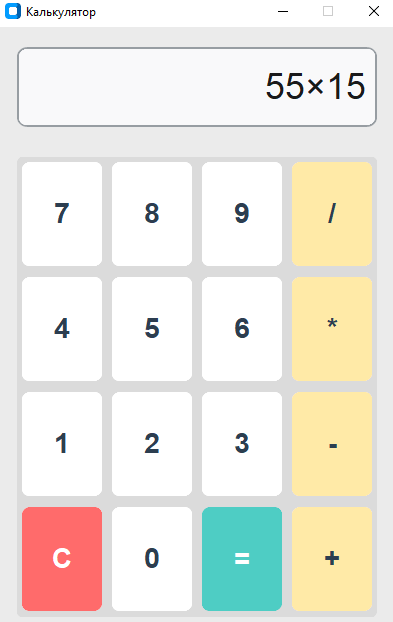

# 🧮 Калькулятор на Python (CustomTkinter)

Простой, элегантный и функциональный калькулятор с графическим интерфейсом, разработанный на Python с использованием библиотеки Tkinter. Приложение выполнено в минималистичном стиле со светлой темой и крупными кнопками для удобного использования.

## Возможности

- Базовые арифметические операции (+, -, ×, ÷)
- Светлая минималистичная тема
- Крупные кнопки для удобства
- Обработка ошибок

## 📸 Скриншот

## ✨ Особенности

- 🎨 **Минималистичный дизайн** — светлая тема, крупные кнопки, приятные глазу цвета
- 🖱️ **Интерактивность** — визуальный эффект при наведении на кнопки
- 🧠 **Умные вычисления** — поддержка основных математических операций (+, -, *, /)
- ⚡ **Быстрая обработка** — одна функция обрабатывает все нажатия кнопок
- 🛡️ **Безопасность** — обработка ошибок (деление на ноль, некорректные выражения)
- 📐 **Фиксированный размер** — окно приложения имеет постоянные размеры

## 🚀 Технологии

- **Python 3.7+** — язык программирования
- **CustomTkinter** — современная библиотека Python для создания GUI

